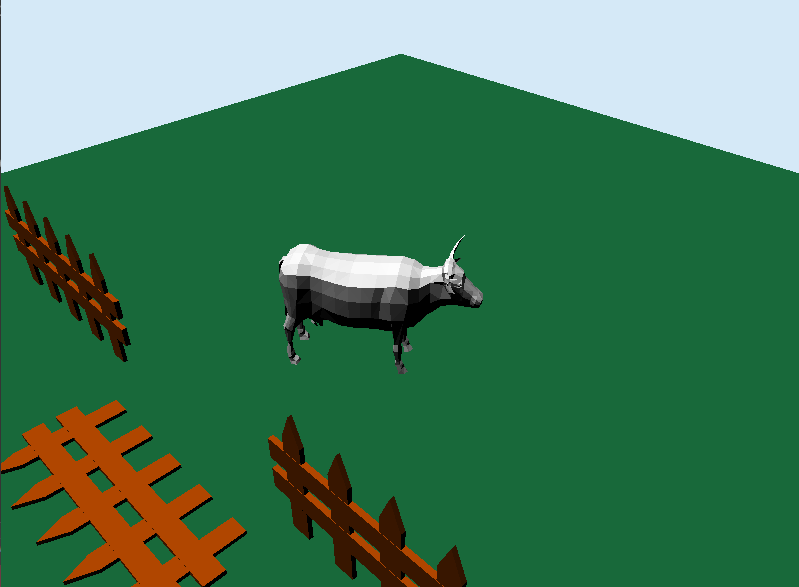

# Bovine Renderer — C++ OpenGL Project

> A rendering project built in C++ and OpenGL that loads and displays multiple '.obj' models, simulates lighting, and performs a hand-crafted animation using transformation matrices and curves.

---

## Overview

This project demonstrates a custom 3D rendering pipeline written in C++, focusing on:
- Loading and displaying multiple 3D models from '.obj' files.
- Implementing basic lighting simulation.
- Creating a manual animation system based on curves and matrix multiplications for transformations.

The goal is to understand and visualize the fundamentals of computer graphics, from the math behind transformations to the light reflection models.

---

## Key Features

- 📦 Load and render multiple '.obj' files.
- 💡 Real-time lighting simulation (ambient and specular).
- 🔁 Custom animation with transformation matrices.
- 🧮 Curve-based motion for smoother interpolation.
- 🖥️ Render pipeline implemented in OpenGL.
- 🎨 Basic shading and camera manipulation.

---

## Instalation

-Clone the repository and open the sln file

-Then, you can just modify it or run it to see a funny cow!

